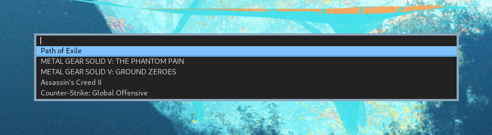

# dsteam
### dmenu launcher for Steam games

Contains the following pathces:
- fuzzymatch
- line height
- separator
- xyw
- border

Also dmenu has been modified to not take stdin input but rather read the db file located at `$HOME/.config/dsteam/db`. The database contents are generated with the included script `dsteam_update`.

After you select the game you want to launch, dsteam will launch the game with its appID. The command it runs looks something like this: `steam steam://run/730`. 730 is the appID for CS:GO for example. The appIDs are read from appmanifests found in the steamapps directory
